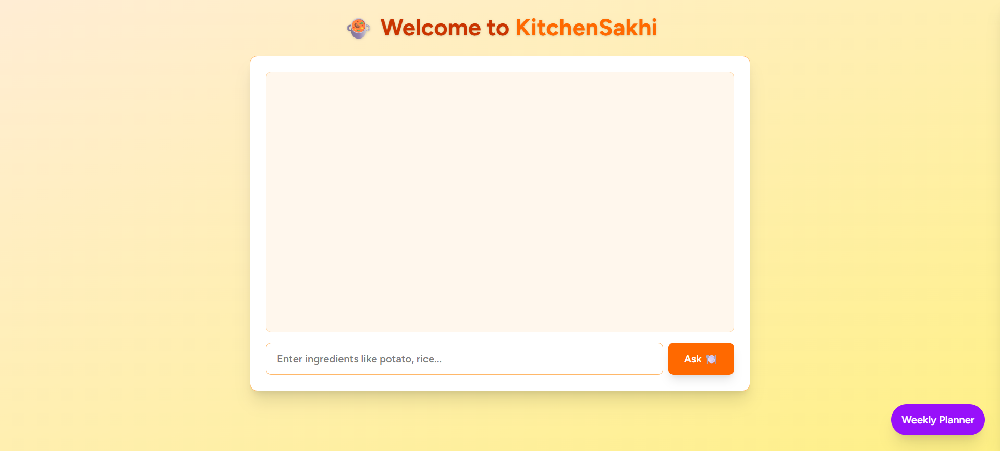

# 🍳 KitchenSakhi — AI-Powered Indian Meal Planner & Chatbot

**KitchenSakhi** is an AI-powered web application that helps users generate weekly meal plans based on their dietary preferences and regional Indian cuisines. It also features a smart ingredient-based chatbot for instant meal suggestions — all while keeping user data and history in MongoDB.

![KitchenSakhi Banner]<!-- Replace with your actual banner if needed -->

---

## 🌟 Features

- ✅ **User Authentication**
  - Signup, Login & Google Sign-In
- 🍛 **AI Meal Plan Generator**
  - Weekly plans for dietary types (Veg, Jain, Eggetarian, etc.)
  - Regional cuisines like South Indian, Gujarati, Bengali, etc.
- 🍽️ **Smart Recipe Chatbot**
  - Suggests dishes using ingredients (via Gemini API)
- 🧾 **Download Meal Plan as PDF**
- 💾 **MongoDB Integration**
  - User history & plan storage
- ⚡ **Modern UI**
  - Built with React + TailwindCSS

---

## 🖼️ Demo

> Coming soon… (or you can deploy it on [Vercel](https://vercel.com/) or [Render](https://render.com/) and link it here)

---

## 🛠️ Tech Stack

| Frontend         | Backend        | AI & PDF | Database     |
|------------------|----------------|----------|--------------|
| React.js         | Flask (Python) | Gemini API (Generative AI) ReportLab for PDFs | MongoDB |
| TailwindCSS      | Flask-CORS     |          |              |

---
## Frontend Setup

cd frontend
npm install
npm run dev